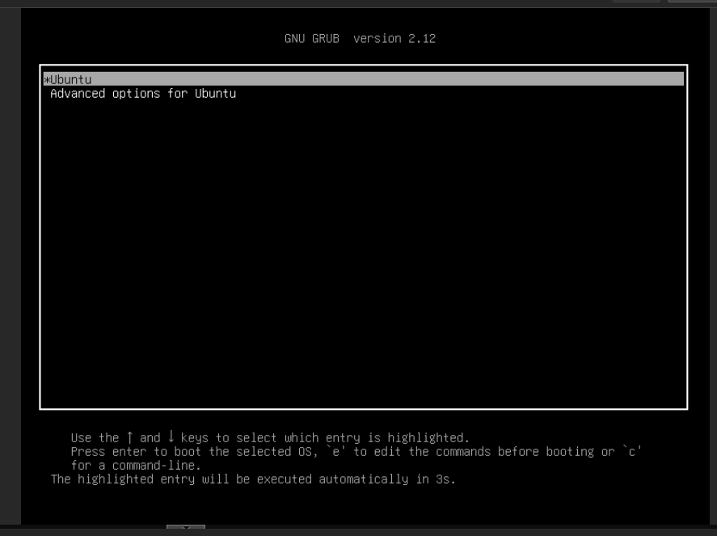
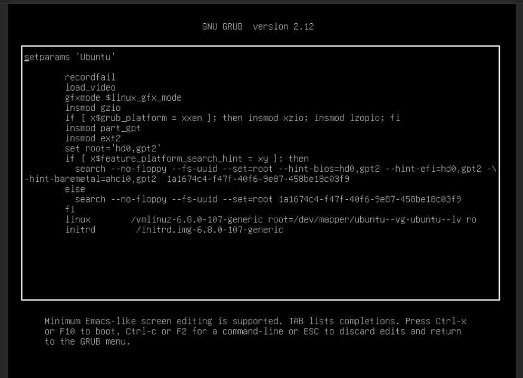
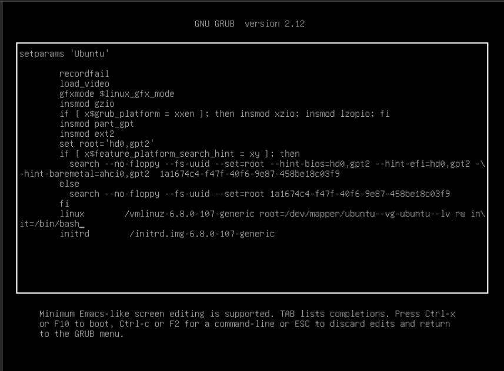
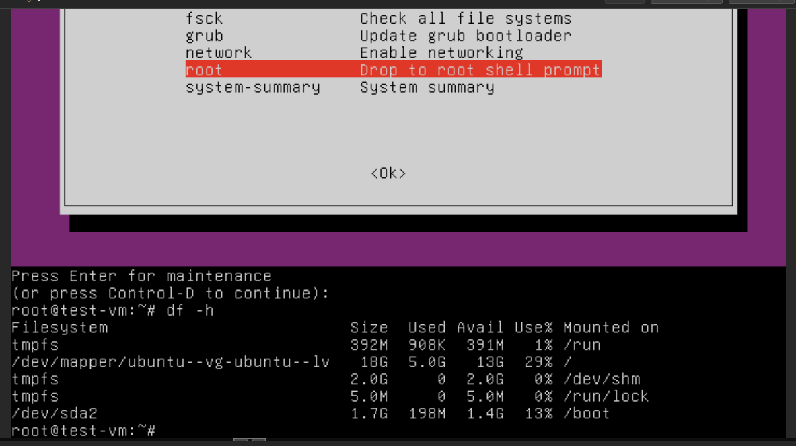

### Загрузка системы

### Задание
1. Включить отображение меню Grub.
2. Попасть в систему без пароля несколькими способами.
3. Установить систему с LVM, после чего переименовать VG

#### Включить отображение меню Grub
Открываем конфиг:  
```
root@test-vm:~# vim /etc/default/grub
```

Ищем строки:  
```
GRUB_TIMEOUT_STYLE=hidden
GRUB_TIMEOUT=0
```

Меняем на:  
```
GRUB_TIMEOUT_STYLE=menu
GRUB_TIMEOUT=3
```

Переконфигурируем GRUB:  
```
root@test-vm:~# update-grub
Sourcing file `/etc/default/grub'
Generating grub configuration file ...
Found linux image: /boot/vmlinuz-6.8.0-107-generic
Found initrd image: /boot/initrd.img-6.8.0-107-generic
Found linux image: /boot/vmlinuz-6.8.0-90-generic
Found initrd image: /boot/initrd.img-6.8.0-90-generic
Warning: os-prober will not be executed to detect other bootable partitions.
Systems on them will not be added to the GRUB boot configuration.
Check GRUB_DISABLE_OS_PROBER documentation entry.
Adding boot menu entry for UEFI Firmware Settings ...
done
```

Перезагружаемся и видим меню:  

#### Попасть в систему без пароля несколькими способами
##### Способ 1
При загрузке видим экран загрузки как на рисунке выше. Нажимаем клавишу `e` и видим параметры загрузки:  


Добавляем параметр `init=/bin/bash` в строке, начинающейся на `linux`, а `ro` меняем на `rw`:  

Нажимаем `ctrl` + `x` и загружаемся в систему.  
##### Способ 2
При загрузке выбираем `Advanced options for Ubuntu` - `Ubuntu, with Linux 6.8.0-107-generic (recovery mode)`. Далее, в этом меню, выбираем `network` и соглашаемся с предупреждением. Выбираем пункт `root`, `enter` и можно работать с системой:  


#### Установить систему с LVM, после чего переименовать VG
Использую уже установленную с LVM систему.  
Смотрим текущее имя vg и меняем его:  
```
root@test-vm:~# vgs
  VG        #PV #LV #SN Attr   VSize   VFree
  ubuntu-vg   1   1   0 wz--n- <18.25g    0 
root@test-vm:~# vgrename ubuntu-vg rasul-vg
  Volume group "ubuntu-vg" successfully renamed to "rasul-vg"
```

Ищем в файле `/boot/grub/grub.cfg` строку:  
```
linux   /vmlinuz-6.8.0-107-generic root=/dev/mapper/ubuntu--vg-ubuntu--lv ro 
```

меняем на:  
```
linux   /vmlinuz-6.8.0-107-generic root=/dev/mapper/rasul--vg-ubuntu--lv ro
```

Перезагружаемся, все работает:  
```
root@test-vm:~# vgs  
 VG       #PV #LV #SN Attr   VSize   VFree  
 rasul-vg   1   1   0 wz--n- <18.25g    0
```
