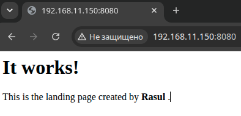

### Задание
Подготовить стенд на Vagrant как минимум с одним сервером. На этом сервере, используя Ansible, необходимо развернуть nginx со следующими условиями:
- необходимо использовать модуль yum/apt;
- конфигурационные файлы должны быть взяты из шаблона jinja2 с переменными;
- после установки nginx должен быть в режиме enabled в systemd;
- должен быть использован notify для старта nginx после установки;
- сайт должен слушать на нестандартном порту — 8080, для этого использовать переменные в Ansible.

### Инструкция по использованию  
1. Необходим установленный ansible (ver 2.21+) и vagrant (в моем случае, в Vagrantfile, инструкции написаны для провайдера libvirt). Для virtualbox - [ссылка](https://drive.google.com/file/d/17MEtg20TFSjKil6ih7PvPez7jmCvo6fb/view?usp=share_link) (нужно будет заменить Vagrantfile)
2. Чтобы не клонировать весь репозиторий скачиваем данную директорию, вставив ссылку в https://download-directory.github.io/  
3. После разархивации переходим в директорию с Vagrantfile и выполняем `vagrant up` 
4. Выполняем `vagrant ssh-config`, копируем путь до ssh-ключа и прописываем его в `ansible_private_key_file` в файле `inventory.ini`. Также проверяем ip, пользователя и порт
5. Проверяем доступ: `ansible nginx -i ./inventory.ini -m ping`
6. Запускаем ansible-роль: `ansible-playbook playbook.yml -i inventory.ini`
7. В результате будет настроен nginx с веб-страницей:  
