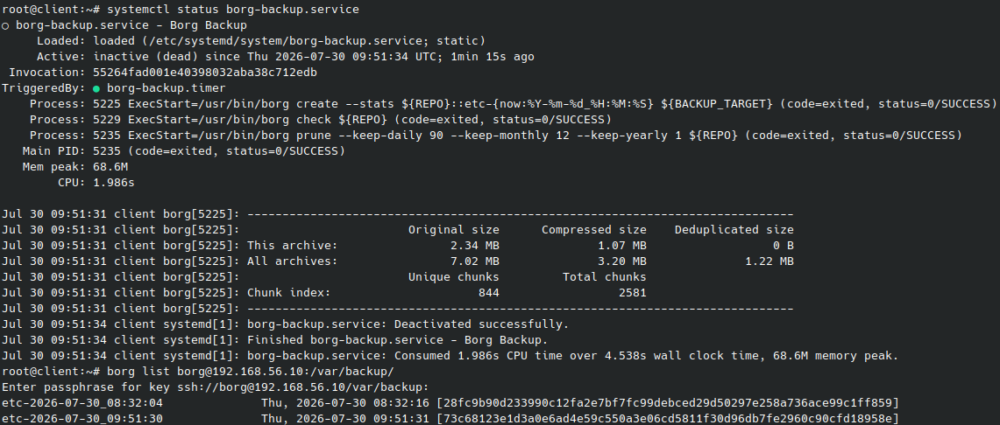
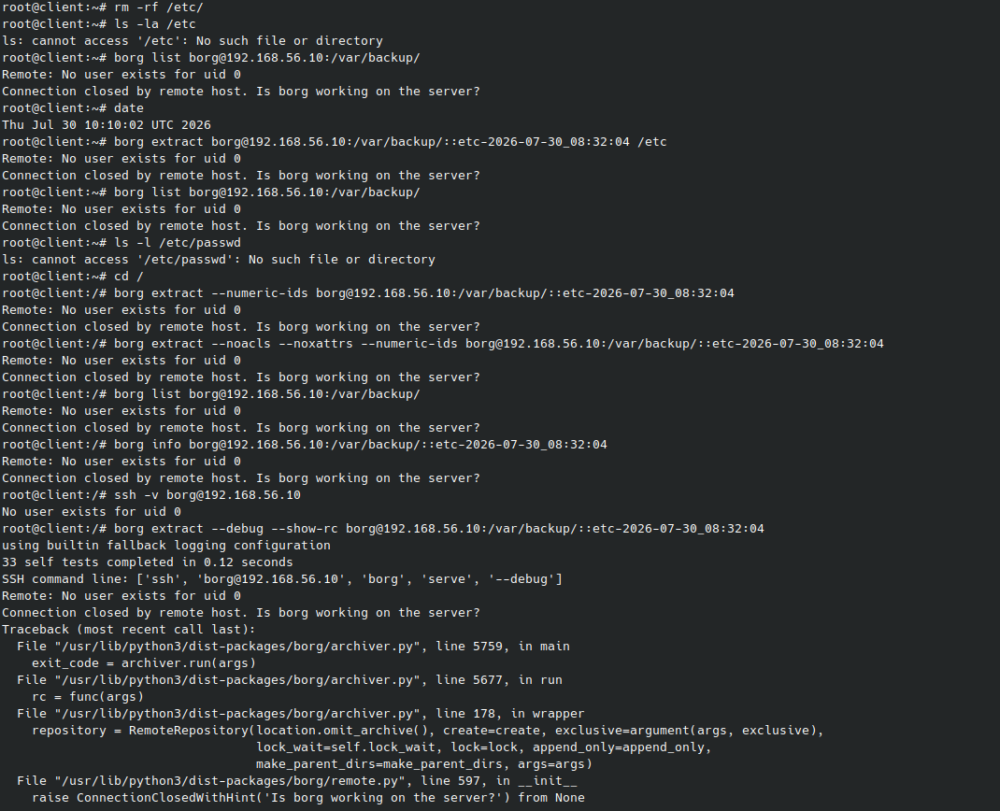

### Резервное копирование
### Задание
Настроить стенд Vagrant с двумя виртуальными машинами: backup_server и client.
Настроить удаленный бекап каталога /etc c сервера client при помощи borgbackup. Резервные копии должны соответствовать следующим критериям:
- директория для резервных копий /var/backup. Это должна быть отдельная точка монтирования. В данном случае для демонстрации размер не принципиален, достаточно будет и 2GB;
- репозиторий дле резервных копий должен быть зашифрован ключом или паролем - на ваше усмотрение;
- имя бекапа должно содержать информацию о времени снятия бекапа;
- глубина бекапа должна быть год, хранить можно по последней копии на конец месяца, кроме последних трех.  
    Последние три месяца должны содержать копии на каждый день. Т.е. должна быть правильно настроена политика удаления старых бэкапов;
- резервная копия снимается каждые 5 минут. Такой частый запуск в целях демонстрации;
- написан скрипт для снятия резервных копий. Скрипт запускается из соответствующей Cron джобы, либо systemd timer-а - на ваше усмотрение;
- настроено логирование процесса бекапа. Для упрощения можно весь вывод перенаправлять в logger с соответствующим тегом. Если настроите не в syslog, то обязательна ротация логов.

Запустите стенд на 30 минут.  
Убедитесь что резервные копии снимаются.  
Остановите бекап, удалите (или переместите) директорию /etc и восстановите ее из бекапа.  

### Выполнение
**Настроить стенд Vagrant с двумя виртуальными машинами: backup_server и client. Настроить удаленный бекап каталога /etc c сервера client при помощи borgbackup. Резервные копии должны соответствовать указанным выше критериям**  
Vagrantfile находится в репозитории.  
Шаги по настройке бэкапа ниже:  
```bash
# выполняем на клиенте, публичный ключ копируем на backup_server в /home/borg/.ssh/authorized_keys
ssh-keygen

# выполняем на клиенте
# инициализируем репозиторий для бэкапов
borg init --encryption=repokey borg@192.168.56.10:/var/backup/

# создаем первый бэкап
borg create --stats --list borg@192.168.56.10:/var/backup/::"etc-{now:%Y-%m-%d_%H:%M:%S}" /etc

# проверяем
borg list borg@192.168.56.10:/var/backup/::etc-2026-07-30_08:32:04
```

Если всё успешно, создадим автоматическое бэкапирование:  
```bash
vim /etc/systemd/system/borg-backup.service
```

Вставляем:  
```
[Unit]
Description=Borg Backup

[Service]
Type=oneshot

# Парольная фраза
Environment="BORG_PASSPHRASE=Otus1234"
# Репозиторий
Environment=REPO=borg@192.168.11.160:/var/backup/
# Что бэкапим
Environment=BACKUP_TARGET=/etc

# Создание бэкапа
ExecStart=/bin/borg create \
    --stats                \
    ${REPO}::etc-{now:%%Y-%%m-%%d_%%H:%%M:%%S} ${BACKUP_TARGET}

# Проверка бэкапа
ExecStart=/bin/borg check ${REPO}

# Очистка старых бэкапов
ExecStart=/bin/borg prune \
    --keep-daily  90      \
    --keep-monthly 12     \
    --keep-yearly  1       \
    ${REPO}

```

Создадим таймер для запуска сервиса:  
```bash
vim /etc/systemd/system/borg-backup.timer
```

Содержимое:  
```
[Unit]
Description=Borg Backup

[Timer]
OnBootSec=5min
OnUnitActiveSec=5min

[Install]
WantedBy=timers.target
```

Запускаем:  
```bash
systemctl daemon-reload
systemctl enable borg-backup.timer 
systemctl start borg-backup.timer
```

**Запустите стенд на 30 минут. Убедитесь что резервные копии снимаются.**  
Скриншот, на котором видно, что бэкапы создаются автоматически:  


**Остановите бекап, удалите (или переместите) директорию /etc и восстановите ее из бекапа.**  
После удаления /etc/ восстановиться не удалось, т.к. возникли проблемы из-за отсутствия /etc/passwd и /etc/group:  


Пришлось создать эти файлы вручную:  
```bash
mkdir /etc
nano /etc/passwd
# Содержимое
root:x:0:0:root:/root:/bin/bash

nano /etc/group
# Содержимое
root:x:0:
```

Выполняем восстановление `/etc`:  
```bash
borg extract borg@192.168.56.10:/var/backup/::etc-2026-07-30_08:32:04
```
