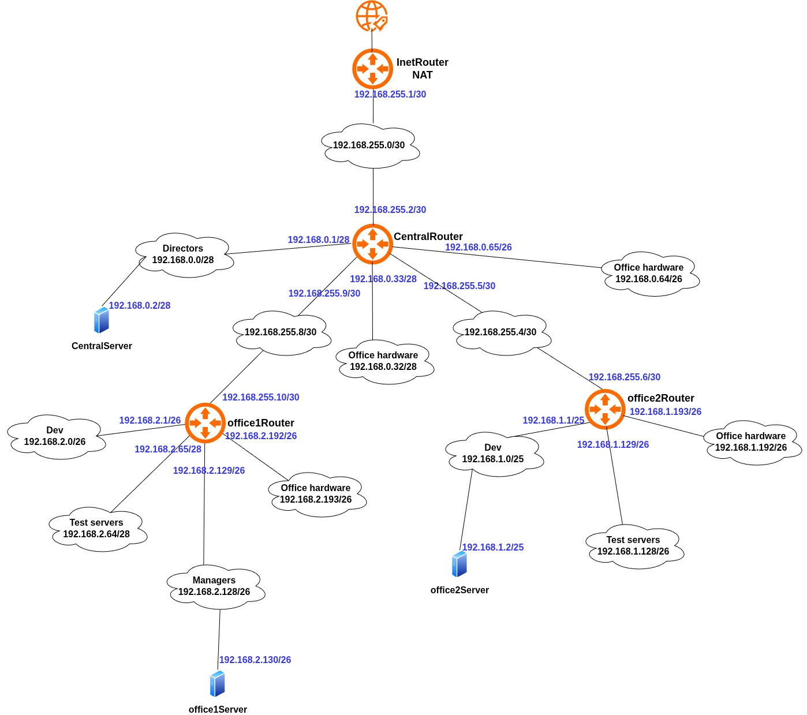
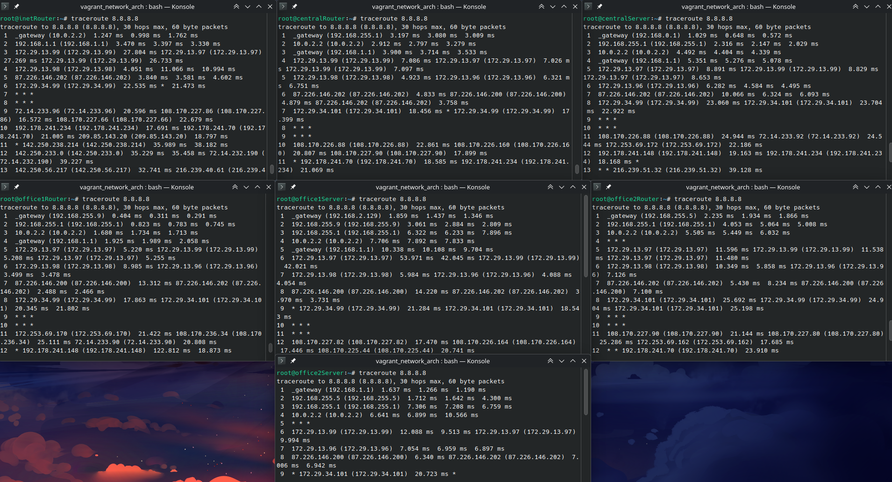

### Задание
**Дано**  
[https://github.com/erlong15/otus-linux/tree/network](https://github.com/erlong15/otus-linux/tree/network "https://github.com/erlong15/otus-linux/tree/network")  
(ветка network)  

Vagrantfile с начальным построением сети
- inetRouter
- centralRouter
- centralServer

**Планируемая архитектура**  
построить следующую архитектуру

Сеть office1
- 192.168.2.0/26 - dev
- 192.168.2.64/26 - test servers
- 192.168.2.128/26 - managers
- 192.168.2.192/26 - office hardware

Сеть office2
- 192.168.1.0/25 - dev
- 192.168.1.128/26 - test servers
- 192.168.1.192/26 - office hardware

Сеть central
- 192.168.0.0/28 - directors
- 192.168.0.32/28 - office hardware
- 192.168.0.64/26 - wifi

```
Office1 ---\
                   -----> Central --IRouter --> internet
Office2----/
```
  
Итого должны получится следующие сервера
- inetRouter
- centralRouter
- office1Router
- office2Router
- centralServer
- office1Server
- office2Server

**Теоретическая часть**
- Найти свободные подсети
- Посчитать сколько узлов в каждой подсети, включая свободные
- Указать broadcast адрес для каждой подсети
- проверить нет ли ошибок при разбиении

**Практическая часть**
- Соединить офисы в сеть согласно схеме и настроить роутинг
- Все сервера и роутеры должны ходить в инет черз inetRouter
- Все сервера должны видеть друг друга
- у всех новых серверов отключить дефолт на нат (eth0), который вагрант поднимает для связи
- при нехватке сетевых интервейсов добавить по несколько адресов на интерфейс

### Выполнение
#### Теоретическая часть

| Name                                   | Network          | Netmask         | N   | Hostmin       | Hostmax       | Broadcast     |
| -------------------------------------- | ---------------- | --------------- | --- | ------------- | ------------- | ------------- |
| **Central Network**                    |                  |                 |     |               |               |               |
| Directors                              | 192.168.0.0/28   | 255.255.255.240 | 14  | 192.168.0.1   | 192.168.0.14  | 192.168.0.15  |
| Office hardware                        | 192.168.0.32/28  | 255.255.255.240 | 14  | 192.168.0.33  | 192.168.0.46  | 192.168.0.47  |
| Wifi (mgt network)                     | 192.168.0.64/26  | 255.255.255.192 | 62  | 192.168.0.65  | 192.168.0.126 | 192.168.0.127 |
|                                        |                  |                 |     |               |               |               |
| **Office 1 network**                   |                  |                 |     |               |               |               |
| Dev                                    | 192.168.2.0/26   | 255.255.255.192 | 62  | 192.168.2.1   | 192.168.2.62  | 192.168.2.63  |
| Test                                   | 192.168.2.64/26  | 255.255.255.192 | 62  | 192.168.2.65  | 192.168.2.126 | 192.168.2.127 |
| Managers                               | 192.168.2.128/26 | 255.255.255.192 | 62  | 192.168.2.129 | 192.168.2.190 | 192.168.2.191 |
| Office hardware                        | 192.168.2.192/26 | 255.255.255.192 | 62  | 192.168.2.193 | 192.168.2.254 | 192.168.2.255 |
|                                        |                  |                 |     |               |               |               |
| **Office 2 network**                   |                  |                 |     |               |               |               |
| Dev                                    | 192.168.1.0/25   | 255.255.255.128 | 126 | 192.168.1.1   | 192.168.1.126 | 192.168.1.127 |
| Test                                   | 192.168.1.128/26 | 255.255.255.192 | 62  | 192.168.1.129 | 192.168.1.190 | 192.168.1.191 |
| Office                                 | 192.168.1.192/26 | 255.255.255.192 | 62  | 192.168.1.193 | 192.168.1.254 | 192.168.1.255 |
|                                        |                  |                 |     |               |               |               |
| **InetRouter - CentralRouter network** |                  |                 |     |               |               |               |
| Inet - central                         | 192.168.255.0/30 | 255.255.255.252 | 2   | 192.168.255.1 | 192.168.255.2 | 192.168.255.3 |
Свободные подсети:  
192.168.0.16/28 
192.168.0.48/28
192.168.0.128/25
192.168.255.64/26
192.168.255.32/27
192.168.255.16/28
192.168.255.8/29  
192.168.255.4/30 

#### Практическая часть
Схема сети (исходник в текущей директории в формате drawio):  


Список серверов:  

| Server         | IP and Bitmask                  |
|----------------|---------------------------------|
| inetRouter     | 192.168.255.1/30                |
| centralRouter  | 192.168.255.2/30                |
|                | 192.168.0.1/28                  |
|                | 192.168.0.33/28                 |
|                | 192.168.0.65/26                 |
|                | 192.168.255.9/30                |
|                | 192.168.255.5/30                |
| centralServer  | 192.168.0.2/28                  |
| office1Router  | 192.168.255.10/30               |
|                | 192.168.2.1/26                  |
|                | 192.168.2.65/26                 |
|                | 192.168.2.129/26                |
|                | 192.168.2.193/26                |
| office1Server  | 192.168.2.130/26                |
| office2Router  | 192.168.255.6/30                |
|                | 192.168.1.1/26                  |
|                | 192.168.1.129/26                |
|                | 192.168.1.193/26                |
| office2Server  | 192.168.1.2/26                  |

Тест связности после настройки:  


Запуск стенда выполняется командой `vagrant up`  