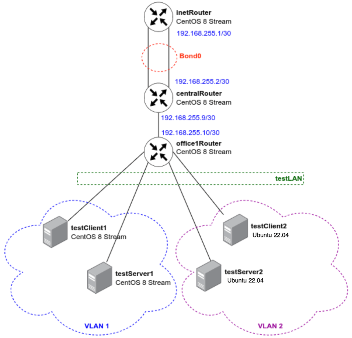

### Сетевые пакеты. VLAN'ы. LACP
### Задание
в Office1 в тестовой подсети появляется сервера с доп интерфейсами и адресами
в internal сети testLAN:

testClient1 - 10.10.10.254
testClient2 - 10.10.10.254
testServer1- 10.10.10.1
testServer2- 10.10.10.1
Равести вланами:
testClient1 <-> testServer1
testClient2 <-> testServer2

Между centralRouter и inetRouter "пробросить" 2 линка (общая inernal сеть) и объединить их в бонд, проверить работу c отключением интерфейсов 
### Результат
Схема сети:  

Для создания машин и запуска плейбука нужно выполнить:  `vagrant up`  